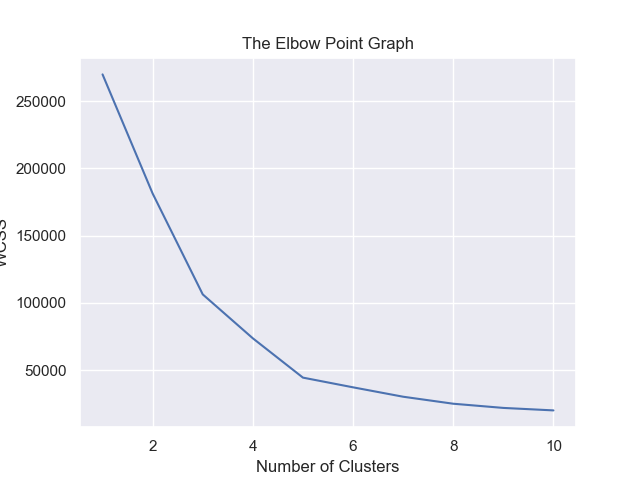
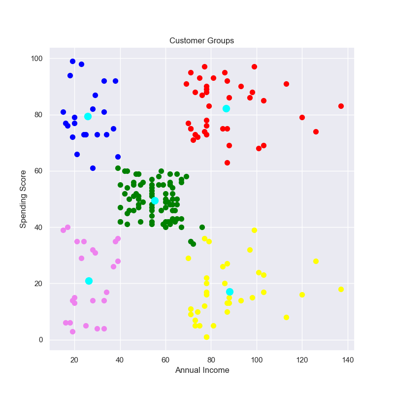

    <h1>Mall Customer Segmentation</h1>

## A jupyter notebook to cluster customers 

### Introduction
You own a supermarket mall and through membership cards, you have some basic data about your customers like Customer ID, age, gender, annual income, and spending score. 

Spending Score is something you assign to the customer based on your defined parameters like customer behavior and purchasing data.

### Problem Statement
Understand the data and cluster the customers into similar groups, so we can give them targeted advertising, products, etc.

### Repository Structure
* **README.md**: The top-level README for reviewers of this project
* **requirements.txt**: requirements file; including the needed tools
* **customer_segmentation.ipynb**:  
* **data folder**: contains the dataset.
* **images**: contains images used in README.md 
    

### Libraries
* pandas
* seaborn
* Matplotlib
* scikit-learn

### Algorithm
K-Means

### Clustering the users:

### Conclusion:
We have selected to have 5 clusters, meaning 5 customer groups. But who are people in these groups? Let's try to describe them for marketing team!

* **Poor and not-spender:** customers with low income and low spending score (cluster #4)
* **Poor and spender:** customers with low income, but spending a lot (cluster #1)
* **Ne**utral:** customers with mid income and mid spending score (cluster #0)
* **Rich and not-spender:** customers with high income and low spending score (cluster #2)
* **Rich and spender:** customers with high income and high spending score (cluster #3)
